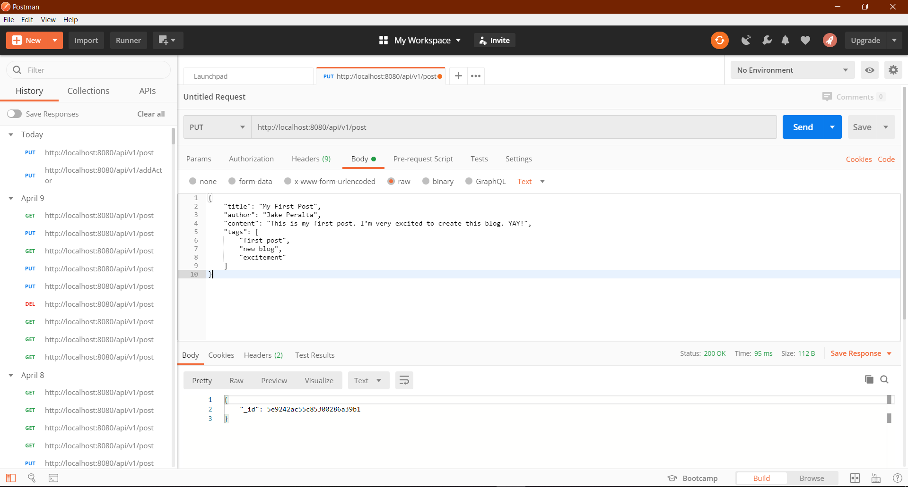

# Blog-Post Api - MongoDB

For this assignment, I have  implement a simple blog post api.

## Testing Endpoints

To test the endpoints I used Postman.

### Sending a Request 

- Open up Postman and select the type of request you would like to send 
- Enter in your request url 
- Open up the request body tab and select raw
- Enter in your request body data into the test box 
- Click Send 




## Project/IDE Setup

### Command Line

- Install maven 

- To compile your code simply run mvn compile in the root directory (the folder that has pom.xml) 

- To run your code run mvn exec:java


#### Eclipse

- File → Import → Maven → Existing Maven Projects 
- Navigate to the project location 
- Right click the project → Maven Build… 
- Input compile exec:java in the Goals input box 
- Click apply then run/close 
- You can now run the project by pressing the green play button

#### MongoDB

- I used Mongo version 4.0 major stable release for this project
- Download and install MongoDB community compass as a means of visualizing your db transactions
- Do not change the default port and the default mongo credentials.
- The mongodb URL must be localhost
- The records mirror the format of the PUT body

## API Usage

The following REST API endpoints run on port 8080. For those unfamiliar with REST a detailed description can be found here (https://www.codecademy.com/articles/what-is-rest). 

### 1. PUT /api/v1/post

Adds a post to the blog (stored in mongodb). Returns the _id from mongodb. If any extra attributes are provided in the request body, they should not be stored in the database. However, the request should still succeed provided all the required attrbutes are present (200 OK).

#### Request Body: 

```
{
    "title": "My First Post",
    "author": "Jake Peralta",
    "content": "This is my first post. I’m very excited to create this blog. YAY!",
    "tags": [
        "first post",
        "new blog",
        "excitement"
	]
}
```

#### Response: 

- `200 OK` for a successful add 
- `400 BAD REQUEST` if the request body is improperly formatted or missing required information 
- `500 INTERNAL SERVER ERROR` if save or add was unsuccessful (Java Exception is thrown)
- `405 METHOD NOT ALLOWED` if called with something other than GET, PUT, DELETE

#### Response Body: 

```
{
	"_id": "3m4jk393jneke93h3k"
}
```

### 2. GET  /api/v1/post

Gets the blog post. Returns a list of corresponding posts. If _id is specified, return the exact post that has that _id. If title is specified, return all posts that contain the specified words in the given title, in order.

#### Request Body: 

```
{
	"title": "First"
}
```

#### Request Body: 

```
{
	"_id": "3m4jk393jneke93h3k"
}
```

#### Request Body:

```
{
    "title": "First",
    "_id": "3m4jk393jneke93h3k"
}
```

#### Response Body:

##### NOTE: Corresponding to the respective Request Bodies  

1. Response Body

```
[
    {
        "_id": {
        	"$oid": "5c705827ae58ed40863c8584"
        },
        "title": "First Day of School",
        "tags": [
        	"school",
        	"excitement",
        	"fun"
        ],
        "author": "Jake Peralta",
        "content": "Fun!"
   	},
    {
        "_id": {
        	"$oid": "3m4jk393jneke93h3k"
        },
        "title": "My First Post",
        "author": "Jake Peralta",
        "content": "This is my first post. I’m very excited to create this blog. 						YAY!",
        "tags": [
        	"first post",
        	"new blog",
        	"excitement"
        ]
    }
]
```

2. Response Body

```
[
    {
        "_id": {
        	"$oid": "3m4jk393jneke93h3k"
        },
        "title": "My First Post",
        "author": "Jake Peralta",
        "content": "This is my first post. I’m very excited to create this blog. 				YAY!",
        "tags": [
        	"first post",
        	"new blog",
        	"excitement"
        ]
    }
]

```

3. Response Body

```
[
    {
        "_id": {
        	"$oid": "3m4jk393jneke93h3k"
        },
        "title": "My First Post",
        "author": "Jake Peralta",
        "content": "This is my first post. I’m very excited to create this blog. 				YAY!",
        "tags": [
        	"first post",
        	"new blog",
        	"excitement"
        ]
    }
]
```

#### Response:

- 200 OK` for a successful add 
- `400 BAD REQUEST` if the request body is improperly formatted or missing required information 
- `500 INTERNAL SERVER ERROR` if save or add was unsuccessful (Java Exception is thrown)
- `404 NOT FOUND` if post does not exist  
- `405 METHOD NOT ALLOWED` if called with something other than GET, PUT, DELETE

### 3.  DELETE  /api/v1/post

Deletes a blog post by _id

#### Request Body: 

```
{
	"_id": "3m4jk393jneke93h3k"
}
```

#### Response: (no response body)

- `200 OK` for a successful add 
- `400 BAD REQUEST` if the request body is improperly formatted or missing required information 
- `404 NOT FOUND` if post does not exist
- `500 INTERNAL SERVER ERROR` if save or add was unsuccessful (if user has done everything as per requirements but request is unable to respond correctly)
- `405 METHOD NOT ALLOWED` if called with something other than GET, PUT, DELETE

## Support

For any questions contact  me at gurashish1000@gmail.com
